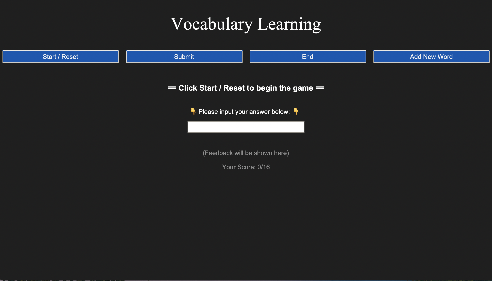
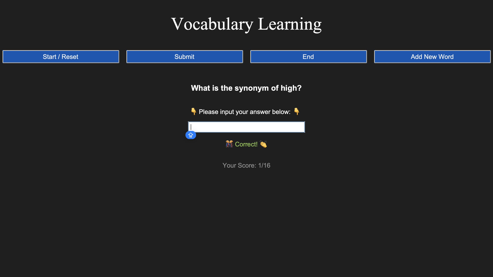
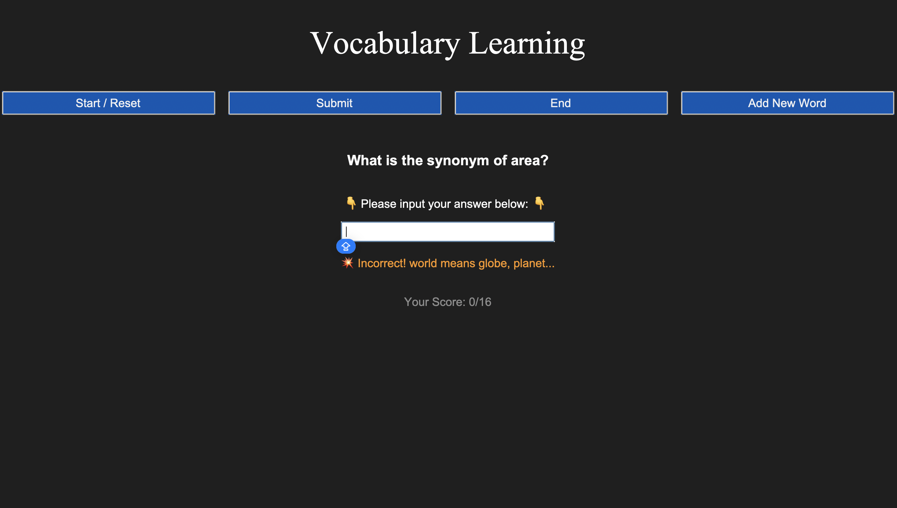

# Vocabulary Learning App

## Introduction

This application is designed to help users learn and test their knowledge of vocabulary synonyms. It presents a series of words and asks the user to input the corresponding synonym.

## Features

- **Start / Reset button**: Begin a new game or reset the current game.
- **Submit button**: Check your answer against the correct synonym.
- **End button**: Close the application.
- **Add New Word button**: Add new words and their synonyms to the game.
- **Score display**: Shows the current score and total number of words.

## Requirements

- Python 3.x
- tkinter library

## Usage

1. Click **Start / Reset** to begin a new game or reset the current game.
2. Enter the synonym for the displayed word in the input box.
3. Press **Submit** or hit Enter to check your answer.
4. Continue answering until all words are completed.
5. Click **End** to close the application.

## Adding New Words

1. Click **Add New Word** to open a dialog.
2. Enter a new word and its synonyms (separated by commas).
3. Click **Submit** to add the new word to the game.

## Screenshots

## Author

Yanan Hu (aka. Skylar Hu)  
Email: [skylarhyn@gmail.com](mailto:skylarhyn@gmail.com)  
LinkedIn: [Skylar Hu](https://www.linkedin.com/in/skylar-hu/)
